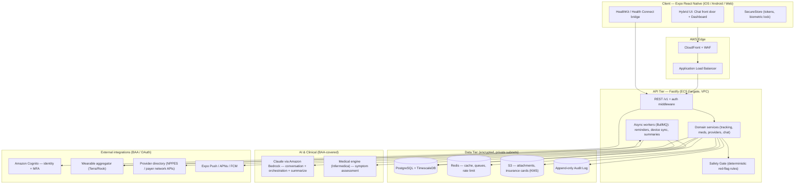

# 02 — System Architecture

**Modes:** 6 (Systems Architect), 2 (MVP Builder)

## 2.1 Design principles

1. **HIPAA-by-construction** — PHI never touches a non-BAA service; every PHI access is
   audited; encryption at rest + in transit is default, not opt-in.
2. **Minimal but not throwaway** — one Postgres, one API, one app codebase. We add
   infrastructure (search, streaming, separate services) only when a real bottleneck
   proves the need — and the schema/module boundaries are drawn so we *can*.
3. **Safety is deterministic** — clinical-risk gating is code, not a prompt.
4. **Two-sided-ready** — identity, tenancy, and consent primitives exist from day one;
   the Provider Layer is new endpoints and screens, not a new architecture.

## 2.2 High-level architecture



## 2.3 Component responsibilities

- **Client (Expo RN):** renders the hybrid UI, captures conversational + structured
  input, reads on-device health data (HealthKit/Health Connect), holds tokens in
  Keychain/Keystore, enforces a biometric app lock. Contains **no clinical logic** and
  **no secrets** beyond the session token.
- **API Gateway/middleware:** authN (Cognito JWT verify), authZ (role + ownership),
  rate limiting, request validation (Zod), structured PHI-redacted logging.
- **Domain services:** tracking, medications/reminders, appointments, providers,
  device connections, conversations, self-diagnosis sessions, consent/audit. Each is a
  module with a clean boundary (see monorepo layout) so it can later become its own
  service if load demands.
- **Safety Gate:** deterministic rules run on every symptom/chat turn *before* the LLM.
  Detects acute red flags (chest pain, stroke FAST, anaphylaxis, suicidal ideation,
  etc.) and short-circuits to emergency guidance. Never bypassable by the model.
- **Async workers (BullMQ on Redis):** medication/appointment reminders, wearable
  polling/webhook ingestion, nightly "evening reflection" summaries, pattern detection.
- **AI tier:** Claude (Bedrock) handles natural-language understanding, orchestration,
  contextualization, and summary generation. The **medical engine** does the actual
  symptom→condition assessment. Clear separation of "conversation" vs "clinical."
- **Data tier:** Postgres for relational/state; TimescaleDB hypertables for
  high-volume device metrics; Redis for cache/queues; S3 (KMS-encrypted) for
  attachments and card images; append-only audit log.

## 2.4 Tech stack & rationale (ADRs)

### ADR-001 — Client: Expo React Native + TypeScript
- **Choice:** Expo (managed workflow w/ config plugins) + Expo Router + TypeScript.
- **Why:** One codebase → App Store + Play + web; the strongest ecosystem for health
  bridges (`react-native-health`, `react-native-health-connect`); EAS handles builds,
  store submission, and OTA updates. Config plugins let us use native HealthKit/Health
  Connect while staying in the managed workflow.
- **Rejected:** Native Swift+Kotlin (≈2× effort, no shared UI); Flutter (fewer
  first-class health/wearable libs, second language away from our TS backend).

### ADR-002 — Backend: Node + Fastify + Prisma (TypeScript)
- **Choice:** Fastify HTTP, Prisma ORM, Zod validation, all TypeScript, in a Turborepo
  monorepo that **shares types and Zod schemas** with the app.
- **Why:** End-to-end type safety (a schema change breaks the app build, not
  production); Fastify is fast and lean; Prisma gives safe migrations. NestJS is a
  drop-in if we later want heavier DI/module conventions.
- **Rejected:** Python/Django (loses shared types); a BaaS-only approach (harder to
  keep clinical/safety logic server-authoritative).

### ADR-003 — Database: PostgreSQL + TimescaleDB
- **Choice:** One managed Postgres (RDS) with the TimescaleDB extension for metric
  timeseries; Redis for cache/queues.
- **Why:** Relational integrity for the health record + native, compressed timeseries
  for device data in the *same* database — no premature second datastore. Scales
  vertically for a long time; read replicas + partitioning when needed.

### ADR-004 — Cloud & compliance boundary: AWS under a BAA
- **Choice:** AWS. HIPAA-eligible services only for PHI: ECS, RDS, S3, KMS, Cognito,
  CloudWatch, **Bedrock**.
- **Why:** Broadest HIPAA-eligible coverage, including running Claude (Bedrock) inside
  the BAA boundary so PHI never leaves it. Terraform/CDK for reproducible infra.
- **Alt (documented):** Supabase (Postgres+Auth+Storage, BAA on paid tiers) for a
  faster MVP — pivotable with no app-code change because the API abstracts data access.

### ADR-005 — Identity: Amazon Cognito, role-based
- **Choice:** Cognito user pool, MFA, hosted OAuth + native flows, custom claim `role`
  (`user` | `provider` | `admin`) and `org_id` for future provider tenancy.
- **Why:** HIPAA-eligible, integrates with API Gateway/ALB, supports the two-sided
  identity model now so Gen 2 needs no auth rework.

### ADR-006 — AI split: Claude (Bedrock) + vetted medical engine
- **Choice:** Claude via Bedrock for conversation/orchestration/summarization; a
  third-party vetted medical engine (Infermedica assumed) for symptom assessment.
- **Why:** The doc mandates a "vetted, medically-trained AI layer" — we do **not**
  home-grow clinical inference. Claude is the latest, most capable model for the
  natural-language + reasoning glue, and Bedrock keeps it inside the AWS BAA. See
  [`07-ai-and-integrations.md`](./07-ai-and-integrations.md).

## 2.5 Monorepo layout (Turborepo)

```
healthy-companion/
├─ apps/
│  ├─ mobile/              # Expo React Native app (iOS/Android/web)
│  └─ api/                 # Fastify backend
├─ packages/
│  ├─ types/               # Shared TS types + Zod schemas (source of truth)
│  ├─ api-client/          # Typed client generated/derived from the API
│  ├─ ui/                  # Shared design-system primitives (universal)
│  ├─ config/              # eslint/tsconfig/prettier presets
│  └─ safety-rules/        # Deterministic red-flag ruleset (shared, tested)
├─ infra/                  # Terraform/CDK (VPC, RDS, ECS, Cognito, KMS…)
├─ docs/                   # This plan
├─ .github/workflows/      # CI/CD
└─ turbo.json / package.json
```

`packages/safety-rules` is deliberately shared: the client can show an immediate
emergency banner from the same ruleset the server enforces authoritatively.

## 2.6 Request lifecycle (example: user reports a symptom in chat)

1. App sends the message over TLS to `POST /v1/conversations/:id/messages`.
2. Middleware verifies the Cognito JWT, resolves the user, checks ownership.
3. **Safety Gate** runs `packages/safety-rules` on the text + known context. Acute red
   flag → return emergency guidance immediately; log; **stop** (no LLM call).
4. Otherwise Claude (Bedrock) classifies intent: *log*, *ask*, *both*. Structured data
   (e.g. "headache, 3pm, severity 6") is extracted and persisted as a `health_event`.
5. If it's a symptom-assessment intent, the service calls the medical engine with the
   user's contextual profile (age/sex/history/meds/recent metrics) and gets a ranked,
   non-diagnostic assessment.
6. Claude composes a contextual, disclaimered response ("possibilities, not a
   diagnosis"); the assessment is saved as a provider-shareable record.
7. Every PHI read/write is written to the append-only audit log with actor, purpose,
   and resource.

## 2.7 Scalability path (only when needed — not day one)

- Stateless API on Fargate → horizontal autoscale behind the ALB.
- Postgres read replicas; TimescaleDB compression + retention for metrics; table
  partitioning on `health_events` by time.
- Redis for hot reads (today's dashboard) and rate limiting.
- Move `chat` and `device-sync` modules to independent services if they dominate load
  — boundaries already drawn to allow it.
- CDN for static/web; per-tenant sharding is a Gen 2+ concern.
