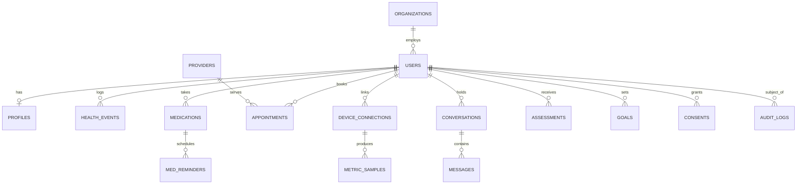

# 03 — Data Model

**Modes:** 6 (Systems Architect), 2 (MVP Builder)

All tables are PHI unless marked otherwise. Everything is encrypted at rest (RDS +
KMS); the columns tagged **🔐 field-encrypted** get an additional application-layer
envelope encryption (KMS data keys) because they are especially sensitive.

## 3.1 Entity overview

## 3.2 Core identity & tenancy

**`organizations`** *(Gen-2-ready; a provider practice or employer)* — `id`,
`type` (`provider`|`employer`), `name`, `npi` (nullable), `created_at`.

**`users`** — `id` (uuid), `cognito_sub` (unique), `role` (`user`|`provider`|`admin`),
`org_id` (nullable FK), `email` 🔐, `phone` 🔐, `status`, `created_at`,
`deleted_at` (soft delete for data-retention/right-to-delete). *Auth lives in Cognito;
this row is the app-side identity + role.*

**`profiles`** — one per user. `user_id` (FK), `first_name` 🔐, `last_name` 🔐,
`date_of_birth` 🔐, `sex_at_birth`, `gender_identity`, `height_cm`, `blood_type`,
`conditions` (jsonb — chronic conditions), `allergies` (jsonb), `family_history`
(jsonb), `pregnancy_status`, `locale`, `emergency_contact` 🔐. This is the "context"
the self-diagnosis engine reads.

## 3.3 Tracking — one polymorphic event table + typed detail

The concept lists many trackable things logged via chat or UI. We use **one
append-only `health_events` table** (uniform querying for the dashboard + patterns)
with a typed `data` payload validated by a per-type Zod schema in `packages/types`.

**`health_events`** — `id`, `user_id`, `type` (enum: `symptom` | `mood` | `energy` |
`food` | `water` | `sleep` | `weight` | `body_metric` | `menstrual` | `substance` |
`sobriety` | `note` | `vitals`), `occurred_at` (tz-aware), `source` (`chat` | `manual`
| `device` | `import`), `data` (jsonb, schema-per-type), `confidence` (for
model-extracted events), `created_at`. Indexed on `(user_id, type, occurred_at)`.

> Why polymorphic + jsonb, not a table per type: the dashboard and pattern engine need
> to scan "everything the user logged" cheaply; new trackables (the doc lists ~10 and
> implies more) become a new enum value + schema, not a migration + new join. High-rate
> device *samples* are the exception — they go to a timeseries table (below).

## 3.4 Medications & reminders

**`medications`** — `id`, `user_id`, `name`, `rxnorm_code` (nullable), `dosage`,
`form`, `is_supplement` (bool), `schedule` (jsonb — times/frequency), `active`,
`prescriber` (nullable), `notes`, timestamps. *Insulin & chronic-condition reminders
are just medications with schedules + a condition tag.*

**`med_reminders`** — `id`, `medication_id`, `scheduled_at`, `status`
(`pending`|`taken`|`skipped`|`missed`), `responded_at`. Generated by a worker;
drives push notifications and adherence tracking.

## 3.5 Appointments & providers

**`providers`** *(directory cache)* — `id`, `npi`, `name`, `specialty`, `type`
(physician/dentist/urgent-care/pharmacy/mental-health/wellness…), `address`, `geo`
(lat/lng), `phone`, `network_ids` (jsonb — payer networks for in/out-of-network),
`source`, `updated_at`. Public-ish reference data (from NPPES + payer directories),
**not** PHI.

**`appointments`** — `id`, `user_id`, `provider_id` (nullable), `title`, `starts_at`,
`location`, `status`, `reminder_offsets` (jsonb), `visit_summary` (nullable — the
"prep for provider visit" export), timestamps. PHI.

## 3.6 Devices & metric timeseries

**`device_connections`** — `id`, `user_id`, `vendor` (`apple_health` |
`health_connect` | `dexcom` | `libre` | `fitbit` | `garmin` | `oura` | `whoop` |
`terra`), `external_account_id`, `access_token` 🔐, `refresh_token` 🔐, `scopes`,
`status`, `last_synced_at`, timestamps.

**`metric_samples`** *(TimescaleDB hypertable — high volume)* — `user_id`, `metric`
(`steps` | `heart_rate` | `hrv` | `sleep_stage` | `spo2` | `glucose` | `bp_systolic` |
`bp_diastolic` | `weight` | `calories` | `uv` …), `value` (double), `unit`, `ts`
(tz-aware, partition key), `device_connection_id`, `source`. Compressed + retention
policy. Aggregates (daily rollups) cached to Postgres/Redis for the dashboard.

> Split rationale: user-authored events (`health_events`) are low-rate and richly
> queried; device samples are high-rate and mostly aggregated. Separating them keeps
> both fast and lets us compress/expire raw samples without touching the health record.

## 3.7 Conversation & AI

**`conversations`** — `id`, `user_id`, `title`, `last_message_at`, timestamps.

**`messages`** — `id`, `conversation_id`, `role` (`user`|`assistant`|`system`),
`content` 🔐, `intent` (`log`|`ask`|`both`|`emergency`), `event_ids` (jsonb — events
this turn created), `safety_flag` (nullable), `model`, `created_at`.

**`assessments`** *(contextualized self-diagnosis records)* — `id`, `user_id`,
`conversation_id` (nullable), `reported_symptoms` (jsonb) 🔐, `context_snapshot` (jsonb
— the profile/meds/metrics used) 🔐, `engine` (e.g. `infermedica`), `engine_version`,
`results` (jsonb — ranked, non-diagnostic possibilities + triage level) 🔐,
`disclaimer_shown` (bool), `shareable` (bool), `created_at`. This is the
"provider-shareable documented record."

## 3.8 Goals, consent, audit

**`goals`** — `id`, `user_id`, `type` (`weight`|`nutrition`|`fitness`|`sleep`|
`hydration`|`sobriety`), `target` (jsonb), `start_date`, `status`, `progress` (jsonb).

**`consents`** — `id`, `user_id`, `scope` (`hipaa_notice` | `device:<vendor>` |
`share:provider:<id>` | `ai_processing` | `ads_contextual`), `granted` (bool),
`version`, `granted_at`, `revoked_at`. Drives what data may be processed/shared;
checked on every relevant path.

**`audit_logs`** *(append-only; no update/delete)* — `id`, `actor_user_id`,
`subject_user_id`, `action` (`read`|`create`|`update`|`delete`|`export`|`share`),
`resource_type`, `resource_id`, `purpose`, `ip`, `user_agent`, `created_at`. **Every
PHI access writes here** (HIPAA §164.312(b)). Written to Postgres and mirrored to an
immutable store (e.g. S3 Object Lock / CloudWatch) for tamper-evidence.

## 3.9 Insurance (Generation 3 — schema stub only, not built)

Defined now so the repo's namesake feature has a home and the model anticipates it —
**no endpoints/UI in Gen 1**: `insurance_cards` (`user_id`, `payer`, `member_id` 🔐,
`group_id` 🔐, `plan`, `front_image_s3` 🔐, `back_image_s3` 🔐, `verified_at`),
`benefits`, `claims_eob`, `fsa_hsa_accounts`, `prior_authorizations`.

## 3.10 Data-lifecycle & PHI rules

- **Encryption:** RDS/KMS at rest for everything; TLS 1.2+ in transit; 🔐 columns get
  application envelope encryption so a DB dump alone never exposes the most sensitive
  fields.
- **Minimization:** the AI tier receives only the fields a task needs
  (`context_snapshot` records exactly what was used).
- **Retention & deletion:** soft-delete + a purge job honoring user
  right-to-delete; raw device samples expire on a retention policy; audit logs are
  retained per HIPAA (6 years).
- **Backups:** encrypted automated RDS snapshots; PITR; tested restores.
